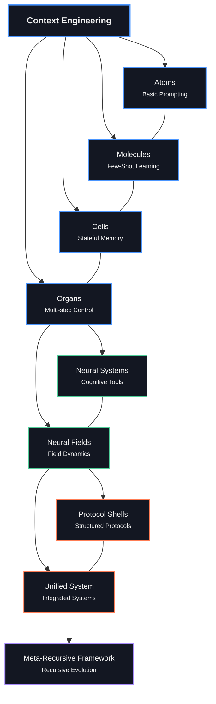

# 基础

> _从原子到统一场：情境工程的理论支柱_
>
>
> **“秩序从混乱的互动中出现。”
— 伊利亚·普里高津**

## [学习将上下文可视化为语义网络和场](https://claude.ai/public/artifacts/6a078ba1-7941-43ef-aab1-bad800a3e10c)

## 概述

该 `00_foundations` 目录包含上下文工程的核心理论基础，从基本的提示概念发展到高级的统一场论。每个模块都建立在前面的模块之上，创建了一个用于理解和作大型语言模型中的上下文的综合框架。

```
                    Neural Fields
                         ▲
                         │
                    ┌────┴────┐
                    │         │
              ┌─────┴─┐     ┌─┴─────┐
              │       │     │       │
        ┌─────┴─┐   ┌─┴─────┴─┐   ┌─┴─────┐
        │       │   │         │   │       │
   ┌────┴───┐ ┌─┴───┴──┐ ┌────┴───┴┐ ┌────┴───┐
   │Atoms   │ │Molecules│ │Cells    │ │Organs  │
   └────────┘ └─────────┘ └─────────┘ └────────┘
      Basic     Few-shot    Stateful    Multi-step
    Prompting    Learning    Memory      Control
```


## 生物隐喻

我们的方法围绕一个生物学隐喻构建，该隐喻为理解情境工程日益复杂的情况提供了一个直观的框架：

| 水平 | 隐喻 | 上下文工程概念 |
|-------|----------|------------------------------|
| 1 | **原子** | 基本说明和提示 |
| 2 | **分子** | 少数镜头示例和演示 |
| 3 | **细胞** | 状态内存和对话 |
| 4 | **器官** | 多步骤应用程序和工作流 |
| 5 | **神经系统** | 认知工具和心智模型 |
| 6 | **神经视野** | 连续的语义景观 |

随着我们逐步通过这些级别，我们从离散、静态的方法转向更连续、动态和紧急的系统。

## 模块进展

### 生物基础（原子→器官）

1. [**01_atoms_prompting.md**](./01_atoms_prompting.md)
   - 基本提示技术
   - 原子指令和约束
   - 直接提示工程

2. [**02_molecules_context.md**](./02_molecules_context.md)
   - 小样本学习
   - 演示和示例
   - 上下文窗口和格式

3. [**03_cells_memory.md**](./03_cells_memory.md)
   - 会话状态
   - 内存机制
   - 信息持久性

4. [**04_organs_applications.md**](./04_organs_applications.md)
   - 多步骤工作流
   - 控制流和编排
   - 复杂的应用程序

### 认知扩展

5. [**05_cognitive_tools.md**](./05_cognitive_tools.md)
   - 心智模型和框架
   - 推理模式
   - 结构化思维

6. [**06_advanced_applications.md**](./06_advanced_applications.md)
   - 实际实施策略
   - 特定于域的应用程序
   - 集成模式

7. [**07_prompt_programming.md**](./07_prompt_programming.md)
   - 类似代码的提示结构
   - 提示中的算法思维
   - 结构化推理

### 场论基础

8. [**08_neural_fields_foundations.md**](./08_neural_fields_foundations.md)
   - 上下文作为连续字段
   - 场属性和动态
   - 向量空间表示

9. [**09_persistence_and_resonance.md**](./09_persistence_and_resonance.md)
   - 语义持久化机制
   - 语义模式之间的共鸣
   - 磁场稳定性和演变

10. [**10_field_orchestration.md**](./10_field_orchestration.md)
    - 协调多个字段
    - 字段交互和边界
    - 复杂的现场架构

### 高级理论框架

11. [**11_emergence_and_attractor_dynamics.md**](./11_emergence_and_attractor_dynamics.md)
    - 上下文字段中的 emergent 属性
    - 吸引子的形成和演化
    - 语义空间中的自组织

12. [**12_symbolic_mechanisms.md**](./12_symbolic_mechanisms.md)
    - LLM 中的紧急符号处理
    - 符号抽象和归纳
    - 机械可解释性

13. [**13_quantum_semantics.md**](./13_quantum_semantics.md)
    - 观察者依赖的含义
    - 非经典语境
    - 量子启发语义模型

14. [**14_unified_field_theory.md**](./14_unified_field_theory.md)
    - 场、符号和量子视角的整合
    - 多角度问题解决
    - 上下文工程的统一框架

## 可视化学习路径

```
┌─────────────────────────────────────────────────────────────────────────┐
│                                                                         │
│  FOUNDATIONS                        FIELD THEORY            UNIFICATION │
│                                                                         │
│  ┌───────┐ ┌───────┐ ┌───────┐     ┌───────┐ ┌───────┐     ┌───────┐   │
│  │Atoms  │ │Cells  │ │Cogni- │     │Neural │ │Emerge-│     │Unified│   │
│  │Mole-  │ │Organs │ │tive   │     │Fields │ │nce &  │     │Field  │   │
│  │cules  │ │       │ │Tools  │     │       │ │Attr.  │     │Theory │   │
│  └───┬───┘ └───┬───┘ └───┬───┘     └───┬───┘ └───┬───┘     └───┬───┘   │
│      │         │         │             │         │             │       │
│      │         │         │             │         │             │       │
│      ▼         ▼         ▼             ▼         ▼             ▼       │
│  ┌─────────────────────────┐       ┌───────────────────┐   ┌─────────┐ │
│  │                         │       │                   │   │         │ │
│  │  Traditional Context    │       │  Field-Based      │   │ Unified │ │
│  │      Engineering        │       │  Approaches       │   │Framework│ │
│  │                         │       │                   │   │         │ │
│  └─────────────────────────┘       └───────────────────┘   └─────────┘ │
│                                                                         │
└─────────────────────────────────────────────────────────────────────────┘
```

## 理论观点

我们的基础模块从三个互补的角度来介绍上下文工程：

```
                        ┌─────────────────┐
                        │                 │
                        │  FIELD VIEW     │
                        │  (Continuous)   │
                        │                 │
                        └─────────┬───────┘
                                  │
                                  │
                    ┌─────────────┴─────────────┐
                    │                           │
       ┌────────────┴────────────┐   ┌──────────┴───────────┐
       │                         │   │                      │
       │   SYMBOLIC VIEW         │   │   QUANTUM VIEW       │
       │   (Mechanistic)         │   │   (Observer-Based)   │
       │                         │   │                      │
       └─────────────────────────┘   └──────────────────────┘
```

### 字段透视
将上下文视为一个连续的语义景观，具有以下特点：
- **吸引子**：稳定的语义配置
- **Resonance**：模式之间的加固
- **持久性**：结构随时间推移的耐久性
- **边界**：语义区域之间的接口

### 符号透视
揭示 LLM 如何通过以下方式实现符号处理：
- **符号抽象**：将标记转换为抽象变量
- **符号归纳**：识别变量上的模式
- **检索**：将变量映射回具体标记

### 量子视角
将 Meaning 作为量子类现象的模型如下：
- **叠加**：同时具有多种潜在含义
- **测量**：解释“折叠”叠加
- **Non-Commutativity**： Order of context operations matters （非交换性：上下文作的顺序很重要）
- **语境性**：意义中的非经典相关性

## 关键概念图

```
                                ┌──────────────────┐
                                │                  │
                                │  Context Field   │
                                │                  │
                                └────────┬─────────┘
                                         │
                 ┌────────────────┬──────┴───────┬────────────────┐
                 │                │              │                │
        ┌────────┴────────┐ ┌─────┴─────┐ ┌──────┴──────┐ ┌───────┴───────┐
        │                 │ │           │ │             │ │               │
        │    Resonance    │ │Persistence│ │  Attractors │ │  Boundaries   │
        │                 │ │           │ │             │ │               │
        └─────────────────┘ └───────────┘ └─────────────┘ └───────────────┘
                                          │
                                 ┌────────┴──────────┐
                                 │                   │
                       ┌─────────┴──────┐   ┌────────┴──────────┐
                       │                │   │                   │
                       │    Emergence   │   │ Symbolic Mechanisms│
                       │                │   │                   │
                       └────────────────┘   └───────────────────┘
                                                      │
                                           ┌──────────┴──────────┐
                                           │                     │
                                  ┌────────┴────────┐   ┌────────┴─────────┐
                                  │                 │   │                  │
                                  │    Abstraction  │   │     Induction    │
                                  │                 │   │                  │
                                  └─────────────────┘   └──────────────────┘
```

## 学习方法

每个模块都遵循以下教学原则：

1. **多视角学习**：从具体、数字和抽象的角度呈现概念
2. **直觉优先**：物理类比和可视化在正式定义之前建立直觉
3. **渐进式复杂性**：每个模块都建立在以前的模块之上，逐渐增加复杂性
4. **实践基础**：理论概念与实际实施相联系
5. **苏格拉底式提问**：反思性问题鼓励更深入的理解

## 读取顺序

对于新手，我们建议遵循模块的数字顺序（01 → 14）。但是，根据您的兴趣，可以采用不同的路径：

### 对于 Prompt 工程师
1 → 2 → 3 → 4 → 7 → 5

### 对于场论爱好者
8 → 9 → 10 → 11 → 14

### 对于 Symbolic Mechanism 风扇
12 → 13 → 14

### 为了全面理解
遵循从 1 到 14 的完整序列

## 与其他目录集成

此目录中的理论基础支持存储库其余部分的实际实现：

- **10_guides_zero_to_hero**：实现这些概念的实用笔记本
- **20_templates**：基于这些基础的可重用组件
- **30_examples**：这些原则的实际应用
- **40_reference**：详细参考资料
- **60_protocols**：实现场论概念的协议 shell
- **70_agents**：利用这些基础的代理实现
- **80_field_integration**：集成所有理论方法的完整系统

## 后续步骤

在探索了这些基础之后，我们建议：

1. 试用 中的实用笔记本 `10_guides_zero_to_hero/`
2. 在 `20_templates/`
3. 学习 中的完整示例 `30_examples/`
4. 探索 协议 shell `60_protocols/`

## 基于现场的学习可视化

```
                        CONTEXT FIELD MAP
            ┌─────────────────────────────────────────┐
            │                                         │
            │    ◎                                    │
            │   Atoms                       ◎         │
            │                            Unified      │
            │                             Field       │
            │                                         │
            │         ◎                               │
            │      Molecules       ◎                  │
            │                  Quantum                │
            │                 Semantics               │
            │                                         │
            │   ◎                                     │
            │  Cells          ◎        ◎              │
            │             Attractors  Symbolic        │
            │                         Mechanisms      │
            │                                         │
            │       ◎                                 │
            │     Organs     ◎                        │
            │              Fields                     │
            │                                         │
            └─────────────────────────────────────────┘
               Attractors in the Learning Landscape
```

我们框架中的每个概念都充当语义景观中的吸引子，指导您的理解对上下文工程进行稳定、连贯的解释。

---

*“这个世界最让人难以理解的地方，就是它是可以理解的。”*
— 阿尔伯特·爱因斯坦
