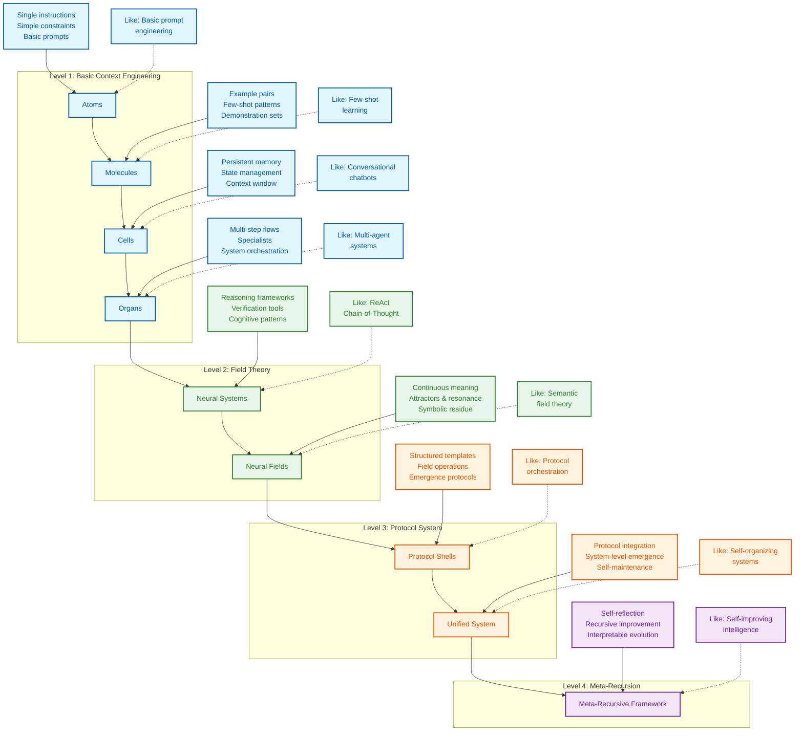

# 上下文工程/情景工程 （Context Engineering）

This Repo translate from https://github.com/davidkimai/Context-Engineering

用第一性原理和视觉实施最新的环境研究 - 2025年6月来自ICML、IBM、NeurIPS、OHBM等

> **“为 GPT-4.1 提供我们的”认知工具“将其在 AIME2024 上的 pass@1 性能从 26.7% 提高到 43.3%，使其非常接近 o1-preview 的性能。”** — [**IBM 苏黎世**](https://www.arxiv.org/pdf/2506.12115)

<div align="center">

### **[IBM 苏黎世](https://www.arxiv.org/pdf/2506.12115) | [量子语义](https://arxiv.org/pdf/2506.10077) | [ICML 普林斯顿](https://openreview.net/forum?id=y1SnRPDWx4) | [MEM1 新加坡-麻省理工学院](https://arxiv.org/pdf/2506.15841) | [LLM 吸引子 上海 AI](https://arxiv.org/pdf/2502.15208?)**

## [与 NotebookLM 聊天 + 播客深入探讨](https://notebooklm.google.com/notebook/0c6e4dc6-9c30-4f53-8e1a-05cc9ff3bc7e)

## [DeepWiki 文档](https://deepwiki.com/davidkimai/Context-Engineering)

</div>

> **“情境工程是一门微妙的艺术和科学，它为下一步提供了正确的信息。” [****](https://x.com/karpathy/status/1937902205765607626)**

<div align="center">

 **[关于涌现、吸引子和动力系统理论](https://content.csbs.utah.edu/~butner/systems/DynamicalSystemsIntro.html) | [哥伦比亚 DST](http://wordpress.ei.columbia.edu/ac4/about/our-approach/dynamical-systems-theory/)**

https://github.com/user-attachments/assets/9f046259-e5ec-4160-8ed0-41a608d8adf3


</div>

一本实用的第一性原理手册，用于从快速工程转向更广泛的上下文设计、编排和优化学科。

```
                    Prompt Engineering  │  Context Engineering
                       ↓                │            ↓                  
               "What you say"           │  "Everything else the model sees"
             (Single instruction)       │    (Examples, memory, retrieval,
                                        │     tools, state, control flow)
```

## 为什么存在此存储库

> **“意义不是语义表达的内在、静态属性，而是通过表达与位于特定上下文中的解释主体之间的动态互动实现的涌现现象。”
> — [Agostino 等人 — 2025 年 6 月，印第安纳大学](https://arxiv.org/pdf/2506.10077)**

快速工程得到了所有的关注，但我们现在可以对接下来的事情感到兴奋。一旦你掌握了提示，真正的强大之处在于设计围绕这些提示的整个**上下文窗口**。如果你愿意的话，这是指导思想。

此存储库提供了一种渐进的第一性原理方法，用于上下文工程，围绕生物学隐喻构建：

```
atoms → molecules → cells → organs → neural systems → neural & semantic field theory 
  │        │         │         │             │                         │    
single    few-     memory/    multi-    cognitive tools +     context = fields +
prompt    shot      agents    agents     prompt programs     persistence & resonance
```

> “抽象是泛化的成本”— [**Grant Sanderson （3Blue1Brown）**](https://www.3blue1brown.com/)



## 正在施工中

```python
Context-Engineering/
├── LICENSE                          # MIT license
├── README.md                        # Quick-start overview
├── structure.md                     # Original structural map
├── STRUCTURE_v2.md                  # Enhanced structural map with field theory
├── context.json                     # Original schema configuration
├── context_v2.json                  # Extended schema with field protocols
├── context_v3.json                  # Neural field extensions
├── context_v3.5.json                # Symbolic mechanism integration
├── CITATIONS.md                     # Research references and bridges
│
├── 00_foundations/                  # First-principles theory
│   ├── 01_atoms_prompting.md        # Atomic instruction units
│   ├── 02_molecules_context.md      # Few-shot examples/context
│   ├── 03_cells_memory.md           # Stateful conversation layers
│   ├── 04_organs_applications.md    # Multi-step control flows
│   ├── 05_cognitive_tools.md        # Mental model extensions
│   ├── 06_advanced_applications.md  # Real-world implementations
│   ├── 07_prompt_programming.md     # Code-like reasoning patterns
│   ├── 08_neural_fields_foundations.md # Context as continuous fields
│   ├── 09_persistence_and_resonance.md # Field dynamics and attractors
│   ├── 10_field_orchestration.md    # Coordinating multiple fields
│   ├── 11_emergence_and_attractor_dynamics.md # Emergent properties
│   │── 12_symbolic_mechanisms.md    # Symbolic reasoning in LLMs
│   ├── 13_quantum_semantics.md      # Multiple meanings (Superposition)
│   └── 14_unified_field_theory.md   # Integrating theory models
│
├── 10_guides_zero_to_hero/          # Hands-on tutorials
│   ├── 01_min_prompt.ipynb          # Minimal prompt experiments
│   ├── 02_expand_context.ipynb      # Context expansion techniques
│   ├── 03_control_loops.ipynb       # Flow control mechanisms
│   ├── 04_rag_recipes.ipynb         # Retrieval-augmented patterns
│   ├── 05_protocol_bootstrap.ipynb  # Field protocol bootstrap
│   ├── 06_protocol_token_budget.ipynb # Protocol efficiency
│   ├── 07_streaming_context.ipynb   # Real-time context
│   ├── 08_emergence_detection.ipynb # Detecting emergence
│   ├── 09_residue_tracking.ipynb    # Tracking symbolic residue
│   └── 10_attractor_formation.ipynb # Creating field attractors
│
├── 20_templates/                    # Reusable components
│   ├── minimal_context.yaml         # Base context structure
│   ├── control_loop.py              # Orchestration template
│   ├── scoring_functions.py         # Evaluation metrics
│   ├── prompt_program_template.py   # Program structure template
│   ├── schema_template.yaml         # Schema definition template
│   ├── recursive_framework.py       # Recursive context template
│   ├── field_protocol_shells.py     # Field protocol templates
│   ├── symbolic_residue_tracker.py  # Residue tracking tools
│   ├── context_audit.py             # Context analysis tool
│   ├── shell_runner.py              # Protocol shell runner
│   ├── resonance_measurement.py     # Field resonance metrics
│   ├── attractor_detection.py       # Attractor analysis tools
│   ├── boundary_dynamics.py         # Boundary operation tools
│   └── emergence_metrics.py         # Emergence measurement
│
├── 30_examples/                     # Practical implementations
│   ├── 00_toy_chatbot/              # Simple conversation agent
│   ├── 01_data_annotator/           # Data labeling system
│   ├── 02_multi_agent_orchestrator/ # Agent collaboration system
│   ├── 03_vscode_helper/            # IDE integration 
│   ├── 04_rag_minimal/              # Minimal RAG implementation
│   ├── 05_streaming_window/         # Real-time context demo
│   ├── 06_residue_scanner/          # Symbolic residue demo
│   ├── 07_attractor_visualizer/     # Field visualization
│   ├── 08_field_protocol_demo/      # Protocol demonstration
│   └── 09_emergence_lab/            # Emergence experimentation
│
├── 40_reference/                    # Deep-dive documentation
│   ├── token_budgeting.md           # Token optimization strategies
│   ├── retrieval_indexing.md        # Retrieval system design
│   ├── eval_checklist.md            # PR evaluation criteria
│   ├── cognitive_patterns.md        # Reasoning pattern catalog
│   ├── schema_cookbook.md           # Schema pattern collection
│   ├── patterns.md                  # Context pattern library
│   ├── field_mapping.md             # Field theory fundamentals
│   ├── symbolic_residue_types.md    # Residue classification
│   ├── attractor_dynamics.md        # Attractor theory and practice
│   ├── emergence_signatures.md      # Detecting emergence
│   └── boundary_operations.md       # Boundary management guide
│
├── 50_contrib/                      # Community contributions
│   └── README.md                    # Contribution guidelines
│
├── 60_protocols/                    # Protocol shells and frameworks
│   ├── README.md                    # Protocol overview
│   ├── shells/                      # Protocol shell definitions
│   │   ├── attractor.co.emerge.shell      # Attractor co-emergence
│   │   ├── recursive.emergence.shell      # Recursive field emergence
│   │   ├── recursive.memory.attractor.shell # Memory persistence
│   │   ├── field.resonance.scaffold.shell  # Field resonance
│   │   ├── field.self_repair.shell        # Self-repair mechanisms
│   │   └── context.memory.persistence.attractor.shell # Context persistence
│   ├── digests/                     # Simplified protocol documentation
│   └── schemas/                     # Protocol schemas
│       ├── fractalRepoContext.v3.5.json    # Repository context
│       ├── fractalConsciousnessField.v1.json # Field schema
│       ├── protocolShell.v1.json           # Shell schema
│       ├── symbolicResidue.v1.json         # Residue schema
│       └── attractorDynamics.v1.json       # Attractor schema
│
├── 70_agents/                       # Agent demonstrations
│   ├── README.md                    # Agent overview
│   ├── 01_residue_scanner/          # Symbolic residue detection
│   ├── 02_self_repair_loop/         # Self-repair protocol
│   ├── 03_attractor_modulator/      # Attractor dynamics
│   ├── 04_boundary_adapter/         # Dynamic boundary tuning
│   └── 05_field_resonance_tuner/    # Field resonance optimization
│
├── 80_field_integration/            # Complete field projects
│   ├── README.md                    # Integration overview
│   ├── 00_protocol_ide_helper/      # Protocol development tools
│   ├── 01_context_engineering_assistant/ # Field-based assistant
│   ├── 02_recursive_reasoning_system/    # Recursive reasoning
│   ├── 03_emergent_field_laboratory/     # Field experimentation
│   └── 04_symbolic_reasoning_engine/     # Symbolic mechanisms
│
├── cognitive-tools/                 # Advanced cognitive framework
│   ├── README.md                    # Overview and quick-start guide
│   ├── cognitive-templates/         # Templates for reasoning
│   │   ├── understanding.md         # Comprehension operations
│   │   ├── reasoning.md             # Analytical operations
│   │   ├── verification.md          # Checking and validation
│   │   ├── composition.md           # Combining multiple tools
│   │   └── emergence.md             # Emergent reasoning patterns
│   │
│   ├── cognitive-programs/          # Structured prompt programs
│   │   ├── basic-programs.md        # Fundamental program structures
│   │   ├── advanced-programs.md     # Complex program architectures
│   │   ├── program-library.py       # Python implementations
│   │   ├── program-examples.ipynb   # Interactive examples
│   │   └── emergence-programs.md    # Emergent program patterns
│   │
│   ├── cognitive-schemas/           # Knowledge representations
│   │   ├── user-schemas.md          # User information schemas
│   │   ├── domain-schemas.md        # Domain knowledge schemas
│   │   ├── task-schemas.md          # Reasoning task schemas
│   │   ├── schema-library.yaml      # Reusable schema library
│   │   └── field-schemas.md         # Field representation schemas
│   │
│   ├── cognitive-architectures/     # Complete reasoning systems
│   │   ├── solver-architecture.md   # Problem-solving systems
│   │   ├── tutor-architecture.md    # Educational systems
│   │   ├── research-architecture.md # Information synthesis
│   │   ├── architecture-examples.py # Implementation examples
│   │   └── field-architecture.md    # Field-based architectures
│   │
│   └── integration/                 # Integration patterns
│       ├── with-rag.md              # Integration with retrieval
│       ├── with-memory.md           # Integration with memory
│       ├── with-agents.md           # Integration with agents
│       ├── evaluation-metrics.md    # Effectiveness measurement
│       └── with-fields.md           # Integration with field protocols
│
└── .github/                         # GitHub configuration
    ├── CONTRIBUTING.md              # Contribution guidelines
    ├── workflows/ci.yml             # CI pipeline configuration
    ├── workflows/eval.yml           # Evaluation automation
    └── workflows/protocol_tests.yml # Protocol testing
```

## 快速开始

1. **阅读 `00_foundations/01_atoms_prompting.md`** （5 分钟）
   了解为什么单独的提示经常表现不佳
2. **跑 `10_guides_zero_to_one/01_min_prompt.py (Jupyter Notebook style)`**尝试使用最小工作示例
3. **探讨 `20_templates/minimal_context.yaml`**将模板复制/粘贴到您自己的项目中
4. **研究 `30_examples/00_toy_chatbot/`**
   查看具有上下文管理的完整实施

## 学习路径

```
┌─────────────────┐     ┌──────────────────┐     ┌────────────────┐
│ 00_foundations/ │     │ 10_guides_zero_  │     │ 20_templates/  │
│                 │────▶│ to_one/          │────▶│                │
│ Theory & core   │     │ Hands-on         │     │ Copy-paste     │
│ concepts        │     │ walkthroughs     │     │ snippets       │
└─────────────────┘     └──────────────────┘     └────────────────┘
         │                                                │
         │                                                │
         ▼                                                ▼
┌─────────────────┐                             ┌────────────────┐
│ 40_reference/   │◀───────────────────────────▶│ 30_examples/   │
│                 │                             │                │
│ Deep dives &    │                             │ Real projects, │
│ eval cookbook   │                             │ progressively  │
└─────────────────┘                             │ complex        │
         ▲                                      └────────────────┘
         │                                                ▲
         │                                                │
         └────────────────────┐               ┌───────────┘
                              ▼               ▼
                         ┌─────────────────────┐
                         │ 50_contrib/         │
                         │                     │
                         │ Community           │
                         │ contributions       │
                         └─────────────────────┘
```

## 您将学到什么

| 概念                         | 它是什么                   | 为什么重要                                 |
| ---------------------------- | -------------------------- | ------------------------------------------ |
| **代币预算**           | 优化上下文中的每个令牌     | 更多的代币 = 更多的 $$ 和更慢的响应        |
| **Few-Shot 学习**      | 通过示例进行教学           | 通常比单独解释效果更好                     |
| **内存系统**           | 跨轮次保留信息             | 支持有状态、连贯的交互                     |
| **检索增强**           | 寻找并注入相关文件         | 以事实为基础做出反应，减少幻觉             |
| **控制流**             | 将复杂任务分解为多个步骤   | 使用更简单的提示解决更难的问题             |
| **上下文修剪**         | 删除不相关的信息           | 仅保留性能所需的内容                       |
| **指标和评估**         | 衡量上下文有效性           | 令牌使用与质量的迭代优化                   |
| **认知工具和提示编程** | Learm 构建自定义工具和模板 | 提示编程为上下文工程启用新层               |
| **神经场论**           | 作为神经场的上下文         | 将上下文建模为动态神经场允许迭代上下文更新 |
| **符号机制**           | 符号架构支持高阶推理       | 更智能的系统 = 更少的工作量                |
| **量子语义**           | 含义 as observer-dependent | 利用叠加技术设计上下文系统                 |

## Karpathy + 3Blue1Brown 风格

> 适合所有经验水平的学习者

1. **基本原则** – 从基本环境开始
2. **迭代插件** – 仅添加模型明显缺少的内容
3. **衡量一切** – 令牌成本、延迟、质量分数
4. **无情地删除** – 修剪胜于填充
5. **代码>幻灯片** – 每个概念都有一个可运行的单元格
6. **可视化一切** — 每个概念都通过 ASCII 和符号图可视化

# 研究证据

## 记忆 + 推理

### **[MEM1：学习协同记忆和推理以实现高效的长视野代理 - 新加坡-麻省理工学院 2025 年 6 月](https://www.arxiv.org/pdf/2506.15841)**

> “我们的结果表明，推理驱动的内存整合有望成为现有解决方案的可扩展替代方案，用于训练长视野交互式代理，其中效率和性能都得到了优化。” [](https://arxiv.org/pdf/2506.15841)


1. **MEM1 训练 AI 代理只保留重要内容，在每一步都融合内存和推理，因此无论任务多长时间，它们都不会不堪重负。**
2. **MEM1 不是堆积无休止的上下文，而是将每次交互压缩成一个紧凑的“内部状态”，就像一个更新而不是复制的智能笔记。**
3. **通过将记忆和思维融合到一个流程中，MEM1 学会了只记住基本要素，从而使座席更快、更敏锐，并能够处理更长的对话。**
4. **代理所做的一切都是标记和结构化的，因此每个动作、问题或事实都清晰易懂——不再有神秘的肉记忆。**
5. **在每个周期中，旧的杂物都会被修剪掉，只使用最新、最相关的见解，这反映了问题解决专家如何提炼他们的笔记。**
6. **MEM1 证明，递归、协议驱动的内存（您总是在其中进行改进和集成）在速度和准确性上都优于传统的“添加更多上下文”方法。**

## 认知工具

### **[使用认知工具在语言模型中引出推理 - IBM 苏黎世，2025 年 6 月](https://www.arxiv.org/pdf/2506.12115)**

### 提示符和提示程序作为推理工具调用

> “认知工具”将推理作封装在 LLM 本身中 — [IBM 苏黎世](https://www.arxiv.org/pdf/2506.12115)


> **这些认知工具（结构化提示模板作为工具调用）通过识别手头的主要概念、提取问题中的相关信息以及突出显示有意义的属性、定理和技术来分解问题
> 可能有助于解决问题。**


> **这些模板支撑着类似于认知心理捷径的推理层，通常被称为 “启发式”。**

1. **这项研究表明，将复杂任务分解为模块化的“认知工具”可以让 AI 更周到地解决问题，这反映了专家级人类如何逐步推理。**
2. **该模型不依赖于单个大型提示，而是调用专门的提示模板，也就是“理解问题”、“回忆相关”、“检查答案”和“回溯”等认知工具——每个模板都处理不同的心理作。**
3. **认知工具就像内在的心理捷径一样：AI 在每个阶段选择正确的程序，并在执行任务之前运行它来规划其推理和下游行动，以提高准确性和灵活性。**
4. **通过将推理步骤划分为模块化块，这些工具可以防止混淆、减少错误，并使模型的思维过程透明且可审计——即使是在困难的数学问题上也是如此。**
5. **这种模块化方法升级了开放和封闭模型，无需额外培训即可提高实际数学问题解决能力，并接近高级 RL 训练的“推理”模型的性能。**
6. **结果表明，强大推理的种子已经在大型语言模型中——认知工具简单地解锁和编排这些能力，为黑盒调优提供了一种透明、高效且可解释的替代方案。**

## 紧急符号

## **[涌现符号机制支持大型语言模型中的抽象推理 - ICML Princeton 2025 年 6 月 18 日](https://openreview.net/forum?id=y1SnRPDWx4)**


> **TL;DR：确定了一种三阶段架构，它通过一组新兴的符号处理机制支持 LLM 中的抽象推理。**

**这些包括符号归纳头、符号抽象头和检索头。**

**1. 在早期层中，符号抽象头根据这些 token 之间的关系将 input token 转换为抽象变量。**

**2. 在中间层中，符号归纳头对这些抽象变量执行序列归纳。**

**3. 最后，在后面的层中，检索头通过检索与预测的抽象变量关联的值来预测下一个标记。**

**这些结果指向了符号和神经网络方法之间长期争论的解决，表明神经网络中的涌现推理取决于符号机制的出现。** — [**ICML 普林斯顿**](https://openreview.net/forum?id=y1SnRPDWx4)


> **为什么有用？**
>
> **这支持了为什么 Markdown、Json 和类似的结构化符号格式更容易进行 LLM 解析**
>
> **概念：与代理合作应用分隔符、语法、符号、符号词、隐喻和结构，以改善推理过程中的推理/上下文/记忆/持久性**

1. **本文证明，大型语言模型开发了自己的内部符号“逻辑电路”——使它们能够使用抽象变量进行推理，而不仅仅是表面的单词模式。**
2. **LLM 展示了一个三阶段的过程：首先从输入中抽象符号，然后对这些变量进行推理，最后将抽象答案映射回现实世界的标记。**
3. **这些涌现的机制意味着 LLM 不仅仅是记忆——它们实际上创造了内部的、灵活的表示，让它们能够推广到新的问题和类比。**
4. **早期层次的注意力头就像“符号提取器”，中间头执行符号推理，而后期头则检索具体答案——反映了类似人类的抽象和检索。**
5. **通过进行有针对性的实验和干预，作者表明这些符号过程对于跨多个模型和任务的抽象推理既必要又足够。**
6. **结果弥合了符号 AI 和神经网络之间的历史差距，表明神经网络可以大规模地发明和使用符号机制，支持真正的泛化和推理。**

## Star 历史

[](https://www.star-history.com/#davidkimai/Context-Engineering&Date)

## 贡献

我们欢迎贡献！查看 [CONTRIBUTING.md](.github/CONTRIBUTING.md) 以获取指南。

## 许可证

[MIT 许可证](LICENSE)

## 引文

```bibtex
@misc{context-engineering,
  author = {Context Engineering Contributors},
  title = {Context Engineering: Beyond Prompt Engineering},
  year = {2025},
  publisher = {GitHub},
  url = {https://github.com/davidkimai/context-engineering}
}
```

## 确认

> 我一直期待着它被概念化和正式化，因为之前没有一个既定的领域。Prompt Engineering 受到了相当大的耻辱，并且没有完全涵盖大多数研究人员和我所做的工作。

- [Andrej Karpathy](https://x.com/karpathy/status/1937902205765607626) 创造了“上下文工程”并启发了这个存储库
- 所有贡献者和开源社区
